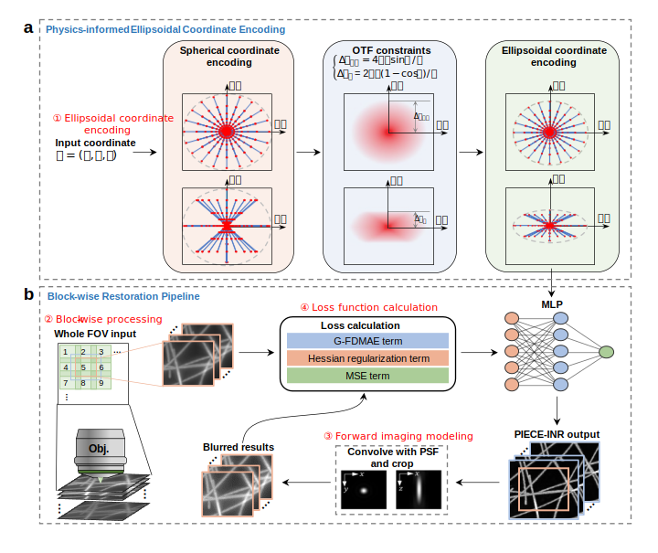

<h1 align="center"><u>P</u>hysics-<u>I</u>nformed <u>E</u>llipsoidal <u>C</u>oordinate <u>E</u>ncoding <u>I</u>mplicit <u>N</u>eural <u>R</u>epresentation for high-resolution volumetric wide-field microscopy</h1>

<div align="center">

You Zhou<sup>†</sup>, Chenyu Xu<sup>†</sup>, Zhouyu Jin<sup>†</sup>, Yanqin Chen, Bei Zheng, Meiyue Wang, Bo Xiong<sup>\*</sup>, Xun Cao<sup>\*</sup>, Ning Gu<sup>\*</sup>

<sup>†</sup>Indicates Equal Contribution
<br>
<sup>*</sup>Corresponding Author

<p>
  <a href="https://www.biorxiv.org/content/10.1101/2024.10.17.618813v1.full.pdf">
    
  </a>
  <a href="https://www.biorxiv.org/content/10.1101/2024.10.17.618813v1">
    
  </a>
  <a href="https://github.com/Chaos1025/PIECE-INR">
    
  </a>
</p>

</div>


Code Repository of [*<u>**P**</u>hysics-<u>**I**</u>nformed <u>**E**</u>llipsoidal <u>**C**</u>oordinate <u>**E**</u>ncoding <u>**I**</u>mplicit <u>**N**</u>eural <u>**R**</u>epresentation (**PIECE-INR**) for high-resolution volumetric wide-field microscopy*](https://www.biorxiv.org/content/10.1101/2024.10.17.618813v1). In this paper, we work for axial-scanning wide-field fluorescnece microscopy restoration with INR technique, and achieve high-resolution volumetric imaging resluts by incorporating specific physical constraint and prior into the self-supervised paradigm.




# Python Packages
Here are versions of some important python package.
```
einops==0.8.1
lpips==0.1.4
matplotlib==3.9.2
MicroscPSF-Py==0.2
numpy==1.26.4
python==3.9.21
scipy==1.13.1
scikit-image==0.24.0
tifffile==2023.4.12
torch==2.6.0
torchvision==0.21.0
tqdm==4.67.1
```
or you can setup the environment by directly running 
```bash
conda env create -f environment.yml
conda activate piece_inr
```

***Note that***: If you want to run the baseline of [InstantNGP](https://github.com/NVlabs/instant-ngp), an additional [tiny-cuda-nn](https://github.com/NVlabs/tiny-cuda-nn) package is needed.

# Data Preparation

PIECE-INR takes the **wide-field measurement stack** and a exteranlly generated **PSF stack** as input, which should be located in `source/<data_name>`. For simulation, a **reference Ground truth** is also needed to calculate metrics. What's more, a `config.yaml` should be provided to specify the optical system parameters.

The `config.yaml` file specify the physical parameters of the wide-field microscopy system, which are listed below:

| key name | description | 
| ---------- | ----------- |
| `NA` | Numerical Aperture | 
| `ni` | Refractive index of the immersion medium |
| `wl` | Emission light wave length (um) |
| `psf_dz` | Axial scanning interval on wide-field microscopy (um) |
| `psf_dx`, `psf_dy` | Lateral pixel size of wide-field microscopy (um) |


As an example, we provide the [simulated Purkinje cell sample](./source/purkinje/) in Fig. 2D, which contain the GT (*`sample.tif`*, downloaded from [CIL Dataset](https://doi.org/doi:10.7295/W9CIL40021)), born-wolf model PSF (*`psf.tif`*), simulated wide-field measurement (*`measurement.tif`*) and config file (*`config.yaml`*). 


# Quick Start
You can use PIECE-INR for reconstruction with our provided *purkinje cell* demo (displayed in our Fig. 2D) by running:
``` Bash
bash scripts/purkinje.sh
```
For convenience, all the required options can be found in the corresponding shell script [purkinje.sh](scripts/purkinje.sh). 

# Running on your own data
### 1. Configure Physical Parameters  
Specify the physical parameters of your experimental system setup in the `config.yaml` properly, which should be located in your data directory `source/<your_own_data_dir>`.

 
### 2. Generate Point Spread Function (PSF) 
Generate the PSF using the parameters defined above. We recommend the [dw_bw](https://github.com/elgw/deconwolf) tool from [Deconwolf](https://doi.org/10.1038/s41592-024-02294-7), which is based on the Born-Wolf model.

### 3. Create Experiment Configuration Script 
Create a shell script to specify your experiment configuration, including:
- Data directory path
- Experiment name
- Loss function weights
- Training epoches 
- Other runtime parameters

A template script is available [here](./scripts/demo.sh). For a comprehensive description of all command-line arguments, run:
```bash
python opt.py -h
```

### 4. Execute Your Experiment
Once the configuration is complete, run your shell script:
```Bash
bash scripts/[your_script_name].sh
```
The results will be saved to the specified output directory upon completion.

# File Structure
```
PIECE-INR
    |-source: data and psf source dir
        |-purkinje
        |...
    |-rec: trained PIECE-INR model, if `saving_model` is "True"
    |-exp: output experiment files
    |-misc: utils used in main code
    |-opt.py: code running configuration
    |-fluor_rec3d.py: reconstructor code
    |-main.py: main training code
    |-ngp_demo.py: a demo baseline based on InstantNGP
```

# Citation
If you find our paper useful for your research, please consider citing this paper:

``` bibtex
@misc{zhou_physics-informed_2024,
    title={Physics-Informed Ellipsoidal Coordinate Encoding Implicit Neural Representation for high-resolution volumetric wide-field microscopy},
    author={Zhou, You and Xu, Chenyu and Jin, Zhouyu and Chen, Yanqin and Zheng, Bei and Wang, Meiyue and Xiong, Bo and Cao, Xun and Gu, Ning},
    year={2024},
    eprint={2024.10.17.618813},
    archivePrefix={bioRxiv},
    doi={10.1101/2024.10.17.618813},
    url={https://www.biorxiv.org/content/10.1101/2024.10.17.618813v1}
}
```
