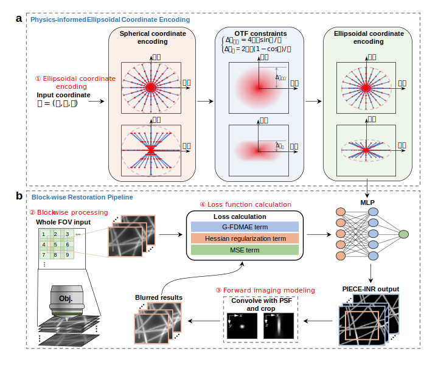

<h1 align="center"><u>P</u>hysics-<u>I</u>nformed <u>E</u>llipsoidal <u>C</u>oordinate <u>E</u>ncoding <u>I</u>mplicit <u>N</u>eural <u>R</u>epresentation for high-resolution volumetric wide-field microscopy</h1>


Code Repository of [*<u>**P**</u>hysics-<u>**I**</u>nformed <u>**E**</u>llipsoidal <u>**C**</u>oordinate <u>**E**</u>ncoding <u>**I**</u>mplicit <u>**N**</u>eural <u>**R**</u>epresentation (**PIECE-INR**) for high-resolution volumetric wide-field microscopy*](https://www.biorxiv.org/content/10.1101/2024.10.17.618813v1). In this paper, we work for axial-scanning wide-field fluorescnece microscopy restoration with INR technique, and achieve high-resolution volumetric imaging resluts by incorporating specific physical constraint and prior into the self-supervised paradigm.




## System Requirements
- Ubuntu 22.4
- cuda 11.8
### Python Packages Requirements
```
python==3.9.0
numpy==1.24.1
torch=2.1.1+cu118
torchaudio=2.1.1+cu118                        
torchstat=0.0.7               
torchvision=0.16.1+cu118 
einops=0.7.0
matplotlib==3.5.1
tifffile=2021.7.2
MicroscPSF-Py=0.2
scipy==1.6.2
tqdm==4.65.0
```

## Dataset
In this repo, we take our simulated Pukeinje cell sample as a demo, where the source GT is downloaded from [CIL Dataset](https://doi.org/doi:10.7295/W9CIL40021).

To make sure a valid support for our PIECE-INR paradigm, some key physical parameters of corresponding experiment setup must be povided, like image lateral resolution, axial-scanning interval, NA, ni and lambda.

All required data file are stored on the dir of `source/<dataset_name>`, like measurement (scanned image stack), PSF (if using `external` option), and GT (on simulation exp).

## Running Code
### Demo
You can easily train the network in *pukeinje cell demo*, where all the required options are intergrated into the corresponding shell script. You can simply change the options by yourself, whose function are descirbed detailly on the file `opt.py`.
``` Bash
bash pukeinje.sh > pukeinje.out
```

### Running on your own data
There is a step-by-step guide to run PIECE-INR on your own data (Suppose you have set up the environment correctly).

1. Generate PSF with your experiment system setup, both Born-Wolf model and Gibson-Lanni model is OK. While the last one is integrated in our code, the former one must be generated externally and upload to the corresponding source dir. Here we recommend the psf tool in [Deconwolf](https://github.com/elgw/deconwolf) for the former PSF generation.

2. Integrate the key physical parameters into your own shell script. Some other control params also should be changed properly.

3. Run your shell script.
```Bash
bash [your_script_name].sh > [your_exp_name].out
```

## File Structure
```
PIECE-INR
    |-source: data and psf source dir
        |-pukeinje
        |...
    |-rec: trained PIECE-INR model, if `saving_model` is "True"
    |-exp: output experiment files
    |-misc: utils used in main code
    |-opt.py: code running configuration
    |-fluor_rec3d.py: reconstructor code
    |-main.py: main training code
```

## Citation

